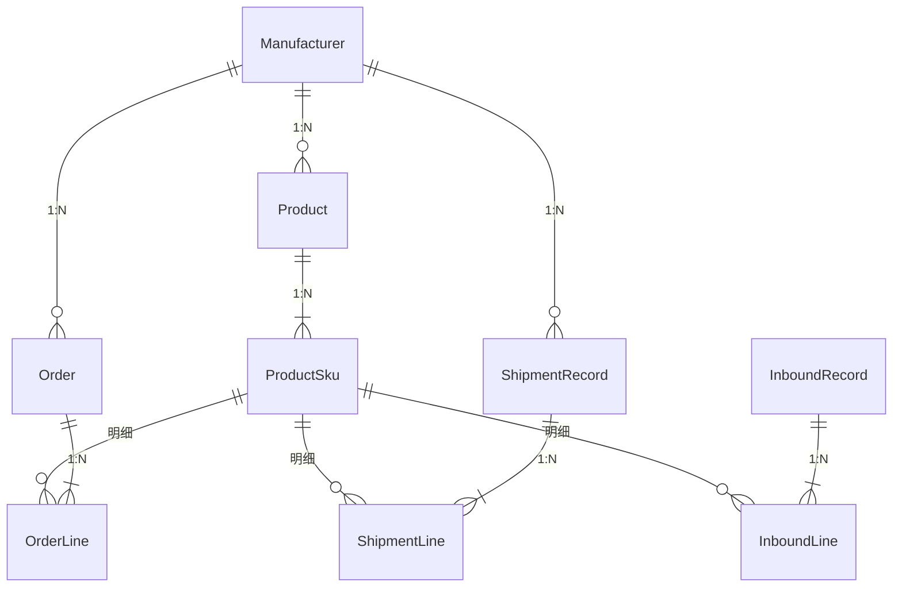

# 数据模型与业务关系

本文描述 **Prisma 模型**之间的关联，以及 **对货统计** 如何从这些表汇总。权威定义见仓库根目录 `prisma/schema.prisma`。

## 实体关系（概念）

**计数粒度**：所有「件数」业务都挂在 **`ProductSku`（颜色 + 尺码）** 上，通过 `skuId` 关联三种明细行。

## 表与字段说明

### Manufacturer（厂家）

- 一件衣服档案归属一个厂家（`Product.manufacturerId`）。
- 可选关联：`ShipmentRecord`、`Order` 头上的厂家（便于筛选与展示；订货单保存时会校验明细 SKU 属于所选厂家）。

### Product（衣服主数据）

- `code`：衣服 ID，唯一。
- `nameInbound` / `nameManufacturer`：入库端名称、厂家端名称（对货列表会同时展示）。
- 价格、材质、主图文件名等为辅数据；主图文件在 `storage/photos/`。

### ProductSku（SKU）

- 同一 `productId` 下 `(color, size)` 唯一（`@@unique`）。
- 被 `OrderLine`、`ShipmentLine`、`InboundLine` 引用；删除衣服（Product）时 SKU 级联删除，**若仍有明细引用则受 Restrict 阻止**（需业务上先不删 SKU 或处理历史单据）。

### Order / OrderLine（订货）

- **头**：`Order` — `note`、可选 `manufacturerId`、时间戳。
- **行**：`OrderLine` — `skuId`、`quantity`。
- 删除订货单：头删则行 `Cascade` 删除。

### ShipmentRecord / ShipmentLine（厂家发货登记）

- **头**：照片必选（业务上）、`recordedAt`、`note`、可选厂家。
- **行**：`skuId`、`quantity`。
- 头删则行 `Cascade`。

### InboundRecord / InboundLine（入库登记）

- **头**：照片、`recordedAt`、`note`。
- **行**：`skuId`、`quantity`。
- 当前模型**未**在库层面绑定厂家（与发货头不同）；对货按 SKU 反查 `Product` / `Manufacturer` 归属。

## 关系基数与删除策略（速查）

| 从 | 到 | 说明 |
|----|----|------|
| Product | Manufacturer | N:1，`onDelete: Restrict`（有货不能删厂家） |
| ProductSku | Product | N:1，`onDelete: Cascade` |
| OrderLine | ProductSku | N:1，`onDelete: Restrict` |
| ShipmentLine / InboundLine | ProductSku | 同上 |
| OrderLine | Order | N:1，`onDelete: Cascade` |
| ShipmentLine | ShipmentRecord | N:1，`onDelete: Cascade` |
| InboundLine | InboundRecord | N:1，`onDelete: Cascade` |

## 对货统计口径（`lib/reports/reconciliation.ts`）

1. **按 `skuId` 汇总**  
   - 订货件数：`OrderLine` `groupBy skuId` → `_sum.quantity`  
   - 发货件数：`ShipmentLine` 同上  
   - 入库件数：`InboundLine` 同上  

2. **仅包含有流水的 SKU**  
   至少在订货、发货、入库**任一**出现过的 `skuId` 进入结果集；再 `findMany` SKU 拉取 `Product`、厂家等展示字段。

3. **衍生指标（每个 SKU）**  
   - **欠发（缺发）** `shortageVsShipped` = `ordered - shipped`  
     - `> 0`：相对订货，厂家发货登记仍不足。  
   - **在途** `inTransit` = `shipped - inbound`  
     - `> 0`：发货登记多于入库登记（可能途中或未入库）。  

4. **聚合维度**  
   - **厂家**：将属于同一 `manufacturerId` 的 SKU 行相加（含厂家下无流水则为 0，具体见实现是否列出全部厂家）。  
   - **衣服（Product）**：将同一 `productId` 下各 SKU 行相加；统计页「按衣服汇总」、档案详情「对货汇总」均基于此思路。  

5. **需关注行**  
   欠发 ≠ 0、在途 ≠ 0，或 **入库 > 发货**（异常，需人工核对）。

## 订货与厂家的业务规则（代码层）

- 创建/更新订货单必选厂家；服务端校验每条 `OrderLine` 的 SKU 对应 `Product.manufacturerId` 与订单头一致。  
- 列表/详情展示订单头厂家时，部分场景通过 `lib/orders/order-manufacturer.ts` 的原始查询读取 `Order.manufacturerId`，再关联厂家名称。

## 环境变量

- **`DATABASE_URL`**：Prisma 数据源。开发常见为 SQLite 文件路径（相对 `prisma` 目录解析，见 `.env.example` 注释）。

## 与文档同步

模型或汇总公式变更时，请同步更新：

- `prisma/schema.prisma`  
- 本文与 `architecture.md`  
- 统计页 UI 上的说明文案（`reports/page.tsx`）
